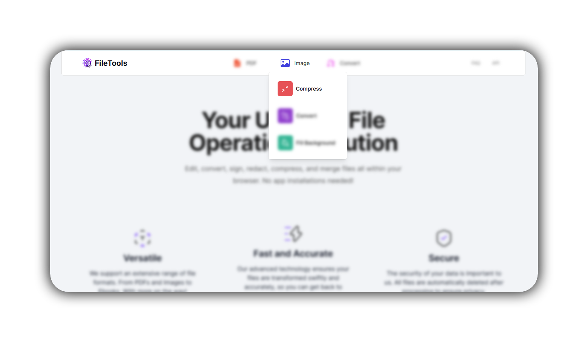
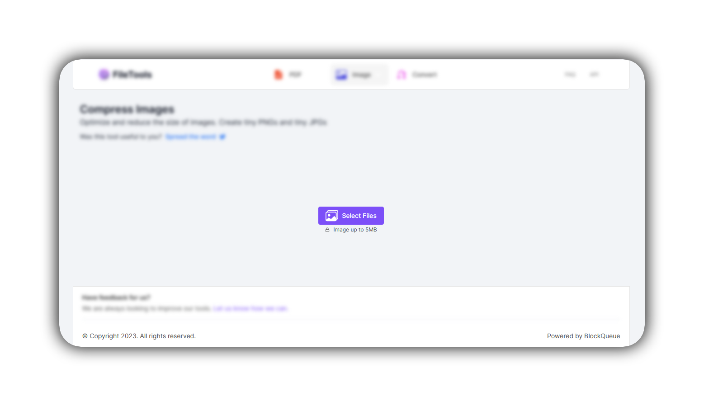
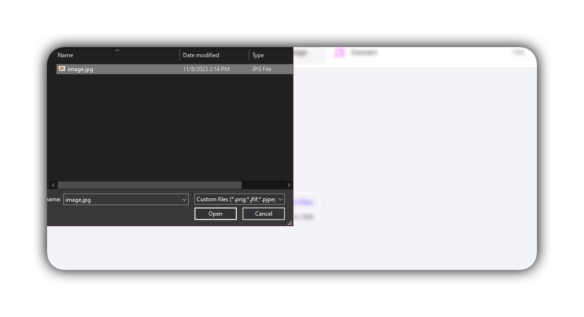
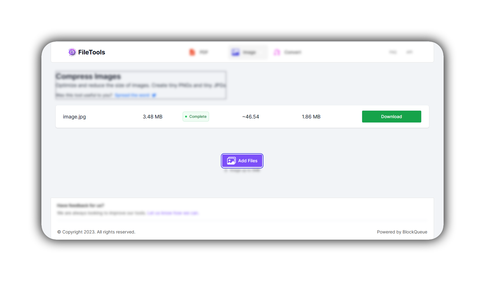
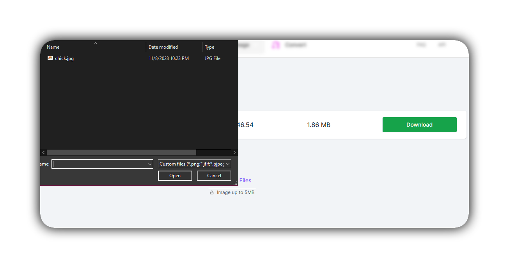
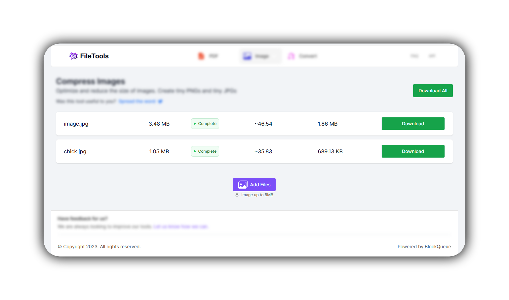

<!-- ## Optimize Your Images With Our Multifunctional Image Compressor -->

In the digital world, managing image files is crucial. Whether you are a professional photographer, a casual snapper, or a web developer, our online image compressor is your go-to tool for handling large photo files. This tool siginificantly reduces image sizes without compromising image quality, making them an essential resource for anyone dealing with large photo files.  

Online image compressors are commonly used to reduce the resolution of images without necessarily affecting image quality, and because they often support batch compression allowing you to compress multiple images simultaneously, they save you valuable time, especially when delaing with large photo collections. This can be very helpful when uploading photos to a website or sending them via email, both of which often have size limitations.  

A perfect example is a  professional photographer needing to share a large number of high-resolution images on their website. Our online image compressor can be used to reduce the size of the images without much loss in quality, making it much easier to upload the images to their website and ensuring that their website loads quickly for their visitors.

Also a web developer working on a project that requires the use of a large number of images can also use our online image compressor to reduce the size of the images with compromising their quality. This not only saves them storage space but also improves the performance of their website.  

Below is a step-by-step pictorial guide on how to use our online image compressor:

- Go to [theFileTools](https://www.thefiletools.com/)

- Click on the `Image` button and select `Compress` from the dropdown menu

- Click on the `Select Files` button in the new page that comes up

- Select the image you wish to compress ...*I have selected this image which is 3.5MB in size*

- You can go ahead to download the already compressed image

- Or you can add more images to be compressed

- Download your compressed images 👍🏾

