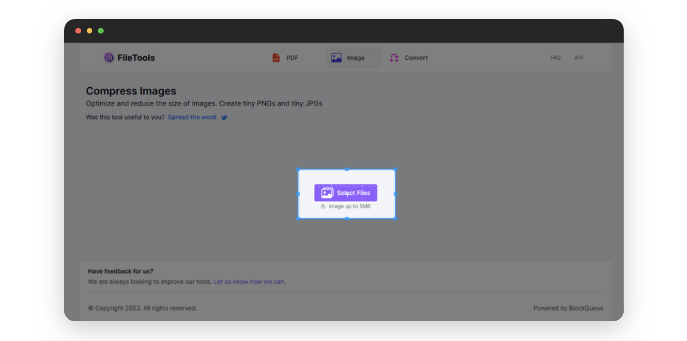
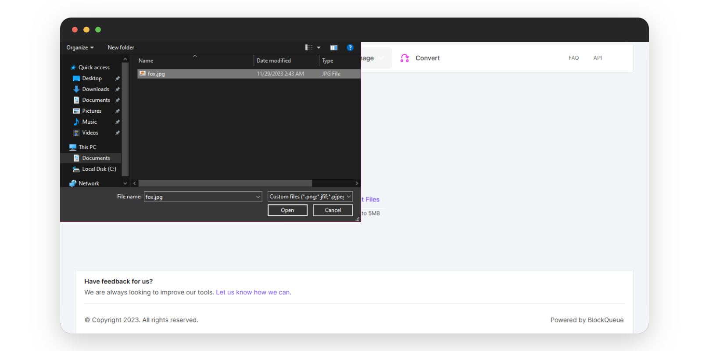
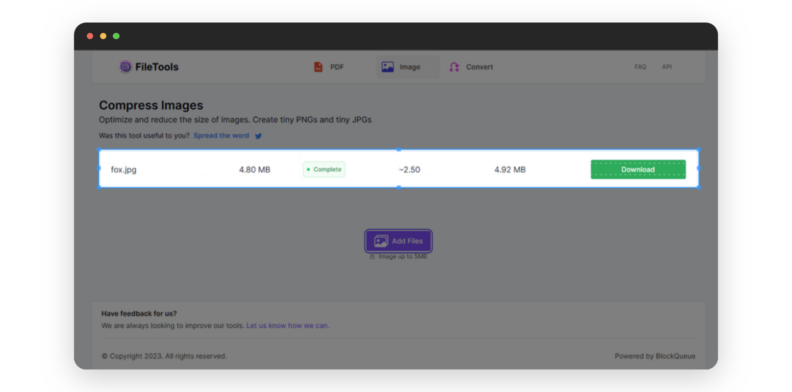
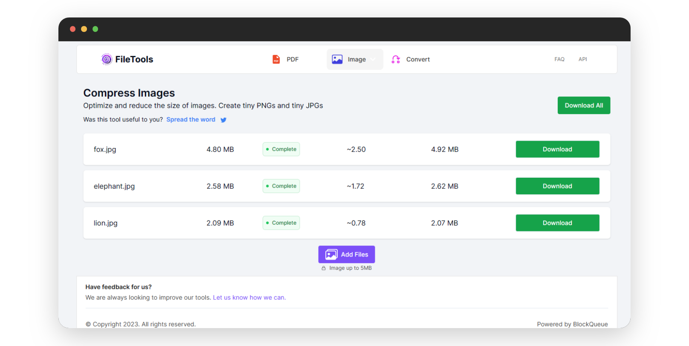

# Optimize Your Images With Our Multifunctional Image Compressor

In the digital world, managing image files is crucial. Whether you are a professional photographer, a casual snapper, or a web developer, our online image compressor is your go-to tool for handling large photo files. This tool siginificantly reduces image sizes without compromising image quality, making them an essential resource for anyone dealing with large photo files.  

Online image compressors are commonly used to reduce the resolution of images without necessarily affecting image quality, and because they often support batch compression allowing you to compress multiple images simultaneously, they save you valuable time, especially when delaing with large photo collections. This can be very helpful when uploading photos to a website or sending them via email, both of which often have size limitations.  

## Reasons To Use Our Online Image Compressor

- **Are you a  professional photographer needing to share a large number of high-resolution images on your website?**  
Our online image compressor can be used to reduce the size of these images without much loss in quality, making it much easier to upload them to your website and ensuring that your website loads quickly for your visitors.

- **Or, are you a web developer working on a project that requires the use of a large number of images?**  
You can also use our online image compressor to reduce the size of these images without compromising their quality. This not only saves storage space but also improves the performance of the website.  

***

Below is a step-by-step pictorial guide on how to use our online image compressor:

- Visit [theFileTools](https://www.thefiletools.com/)

    

- Click on the `Image` button and select `Compress` from the dropdown menu

    

- Click on the `Select Files` button in the new page that comes up

    

- Select the image you wish to compress

    

- You can download the already compressed image,

    

- or you can add more images to be compressed

    

    

- Download your compressed images 

    

