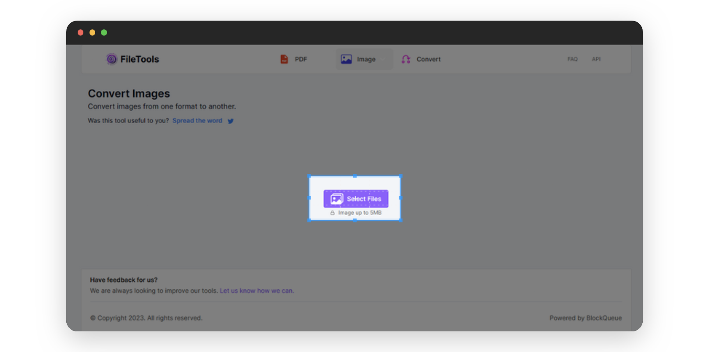
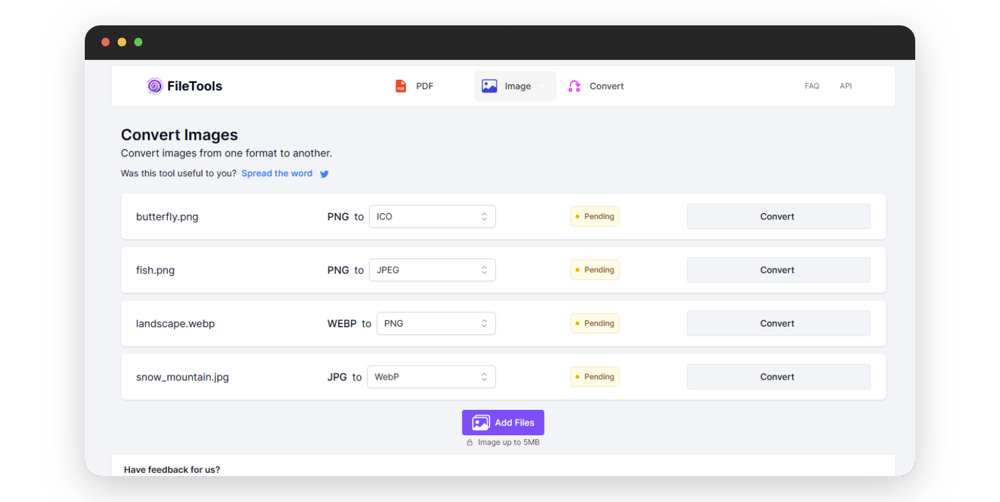

# Seamless Image Conversion With Our Image Converter Tool

Whether you're a graphic designer, a digital artist, or a casual user looking to share photos online, our online image converter is an indispensable tool for managing your image files. This tool allows you to effortlessly convert between image formats, such as JPG to PNG, WEBP, ICO, and vice versa, without compromising on image quality. This makes it a valuable resource for anyone who needs to share images across different platforms or applications.

## Reasons To Convert Your Images:

* **Social media networks often support specific image formats (Instagram only supports JPG and PNG)**. This means that social media influencers will need to convert their images to supported formats before posting them on social media platforms.
* **Certain image formats are more compatible with specific graphic design tools**. Graphic designers will need to convert their images to compatible formats when using these design tools.
* **Image formats supported by the web vary widely**. If you intend to use an image on a website, it may be necessary to convert it to a web-friendly format.
  
### Benefits Of Using Our Image Converter:

Our online image converter is designed to be user-friendly, accessible from any internet-compatible device, and it supports a wide range of formats.

***

Below is a step-by-step pictorial guide on how to use our online image converter:

- Visit [theFileTools](https://www.thefiletools.com/)

    

- Click on the `Image` button and select `Convert` from the dropdown menu

    

- Click on the `Select Files` button in the new page that comes up

    

- Select the image(s) you wish to convert *...I have selected a couple of images which I will be converting to different digital formats*

    

- Select the format you wish to convert to 
    
    I will convert

    - `butterfly.png` to ico
    - `fish.png` to jpeg
    - `landscape.webp` to png
    - `snow_mountain.jpg` to webp

    

- and click the respective `Convert` buttons to convert the images to desired formats

    

- You can download the converted images individually, or click the `Download All` in the top-right corner to download all the images in a zip file

    

