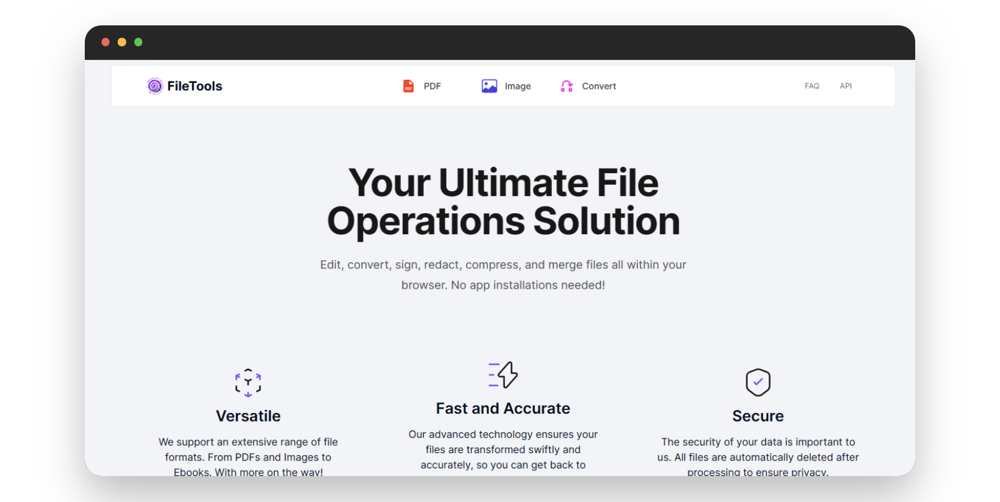
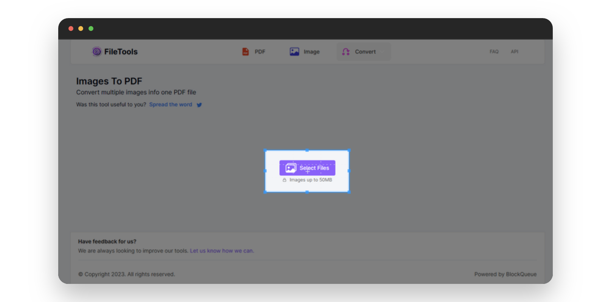
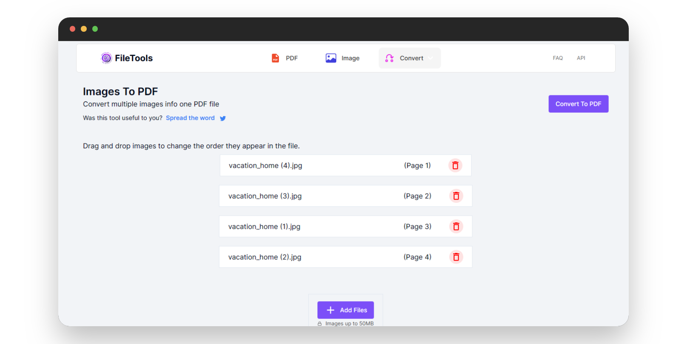
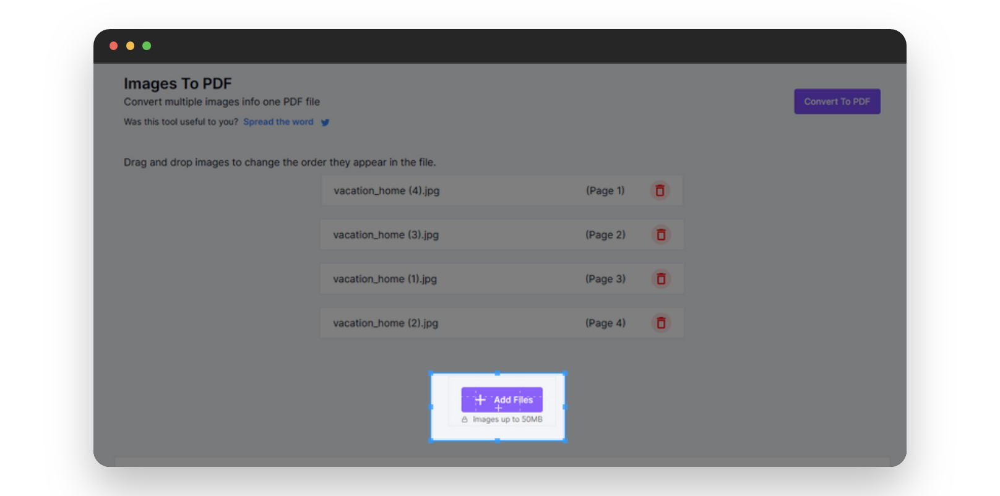
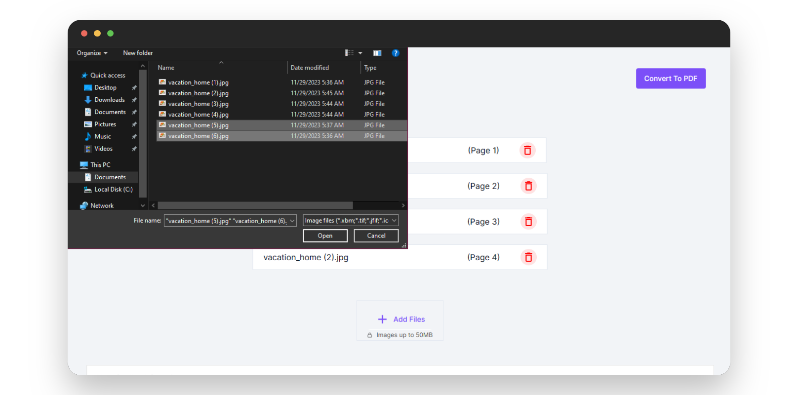
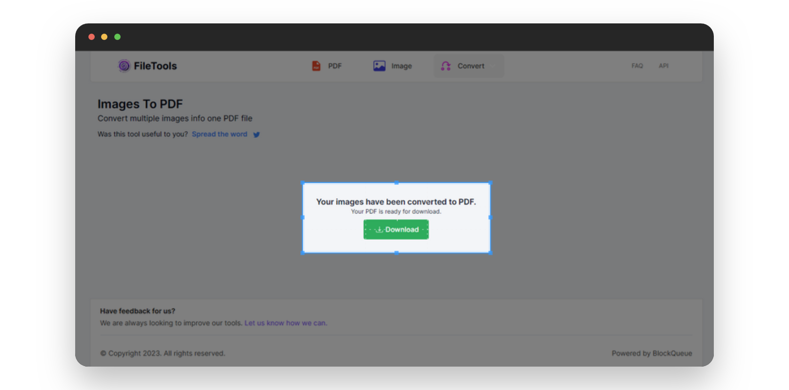

# Effortless PDF Creation from Your Images with Our Image to PDF Converter

In today's digital world where every image tells a story, our online image to PDF converter steps in as your go-to solution providing a simple way to convert your cherished images into easily shareable documents.

## Reasons To Convert Your Images To PDF:

* **Universal Sharing**: PDFs are universally recognized, making them the perfect format for sharing your visual memories with friends, family, or colleagues.
* **Preserve Visual Integrity**: Worried about image quality? Converting to PDF ensures your visuals remain crisp and clear across various devices.
* **Professional Presentation**: Whether it's for work or personal projects, PDFs add a touch of professionalism when presenting visual materials.

### Benefits of Using Our Image-To-PDF Converter:

Our online image to PDF converter is easy-to-use, supports diverse image formats, and designed for effortless conversion.

***

Below is a step-by-step pictorial guide on how to use our online image to PDF converter:

- Go to [theFileTools](https://www.thefiletools.com/)

- Click on the `Convert` button and select `Images to PDF` from the dropdown menu

- Click on the `Select Files` button in the new page that comes up

- Select the image(s) you wish to convert to PDF files ...*I have selected a couple of images*

- You can drag and drop images to specify the order they appear in the PDF file

- You can also add more images to be converted to a PDF document

- Click the `Convert To PDF` button to convert the uploaded images to a single PDF file

- Download your PDF file

