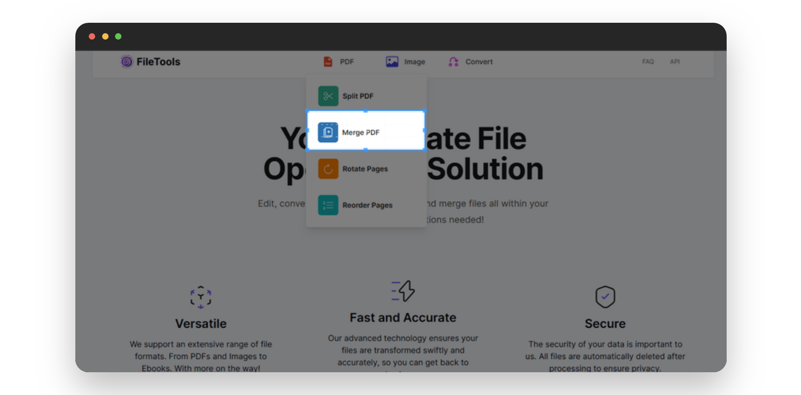
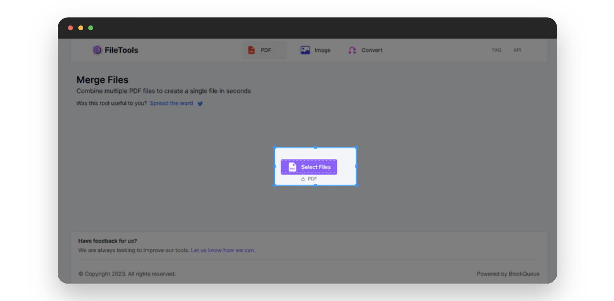
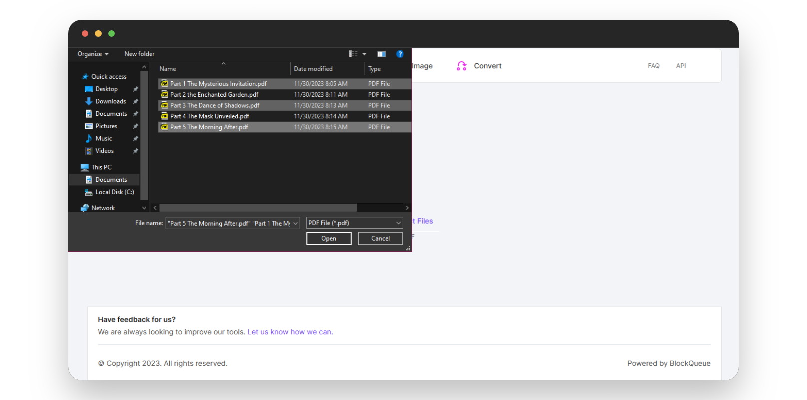
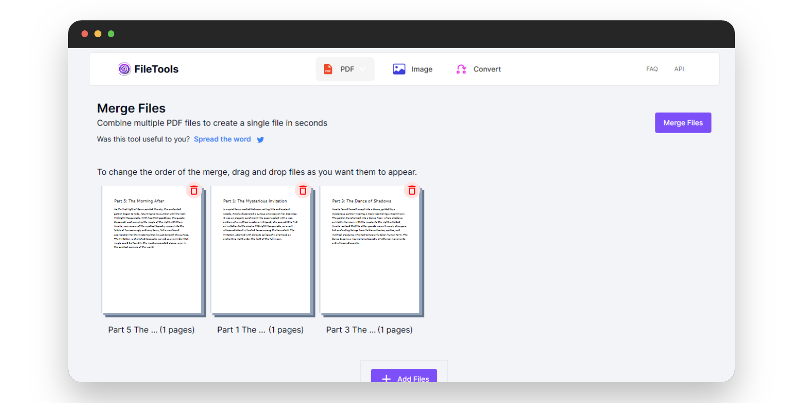
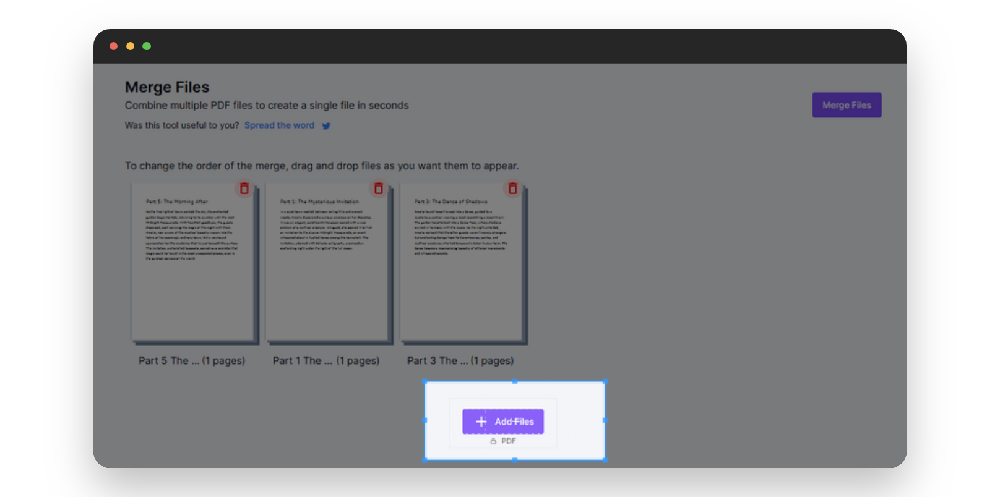
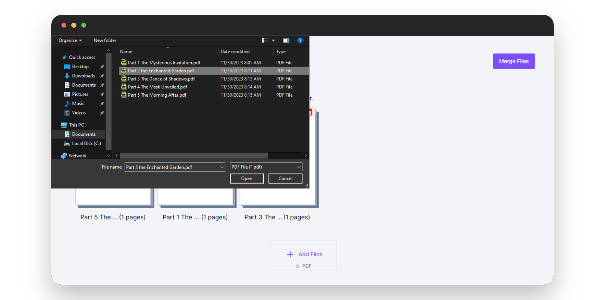
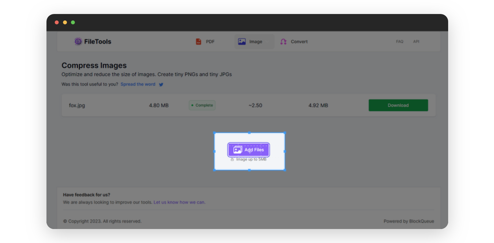
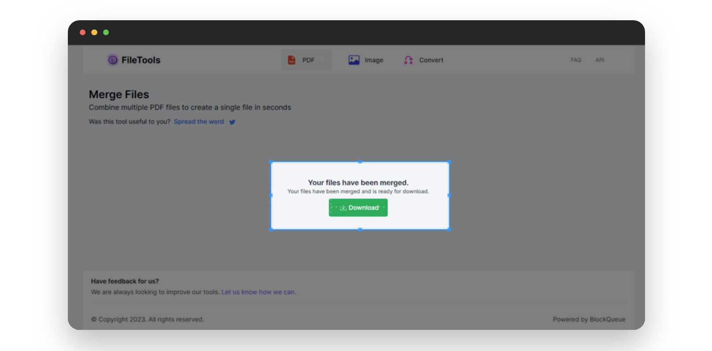

# Effortless Document Fusion with Our Online PDF Merging Tool

Simplicity is essential in the world of digital documents. Our online PDF merging tool is your simple solution, designed for people who aren't tech-savvy but want a straightforward way to combine and organize their PDF files. Whether you're merging multiple PDFs or combining multiple documents into one cohesive file, this tool makes the process effortless and requires very little technical knowledge.

## Reasons To Merge Your PDFs:

* **Effortless Collaboration**: Merge multiple PDFs into a single, well-organized document for easy access and streamlined information.
* **Easy Collaboration**: Combining PDFs makes it possible for group members to edit and share files together without getting confused by multiple files when working on a project.
* **Create Comprehensive Reports**: Merge various sections or chapters into one cohesive document, ideal for creating comprehensive reports or presentations.
* **Simplify Sharing**: Instead of sending multiple files, merge PDFs to simplify sharing and ensure recipients have all relevant information in one document.

### Benefits Of Using Our PDF Merging Tool:

Our PDF merging tool offers user-friendly simplicity, universal accessibility from any internet-compatible device, and seamless support for merging PDF files effortlessly.

***

Below is a step-by-step pictorial guide on how to use our online PDF merging tool:

- Visit [theFileTools](https://www.thefiletools.com/)

    

- Click on the `PDF` button and select `Merge PDF` from the dropdown menu

    

- Click on the `Select Files` button in the new page that comes up

    

- Select the PDF files you wish to merge

    

- You can select the order you want the PDF files to be merged in

    

- And you can also add more file(s)

    

    

- Click the `Merge` button in the top right corner to merge the PDF files

    

- Download the merged PDF

    

