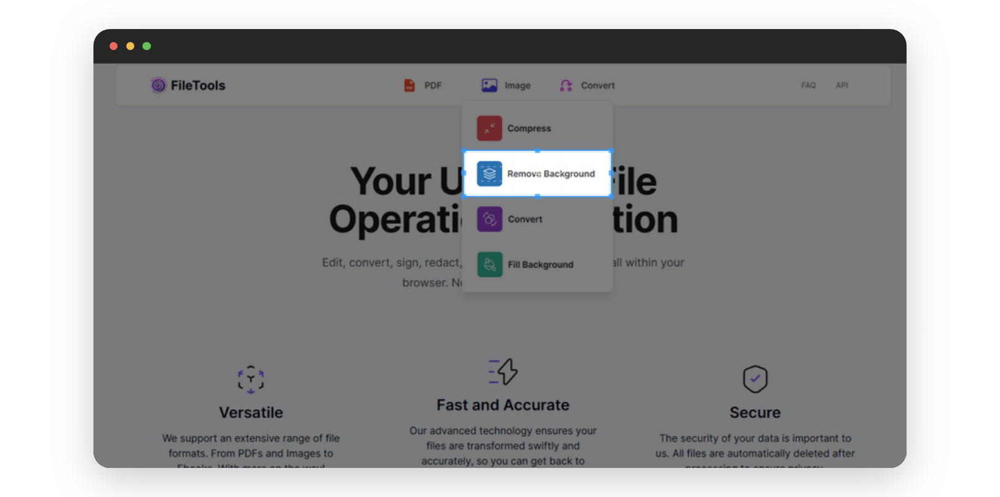
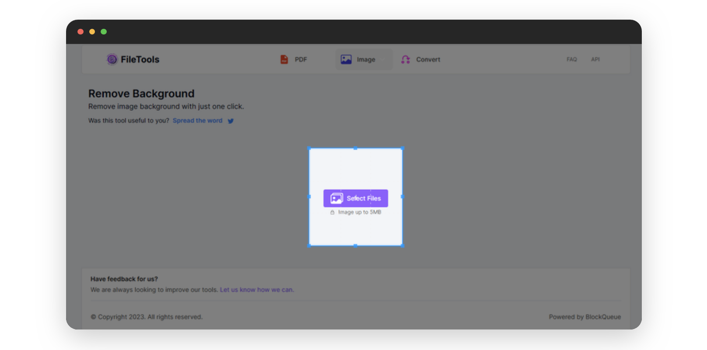
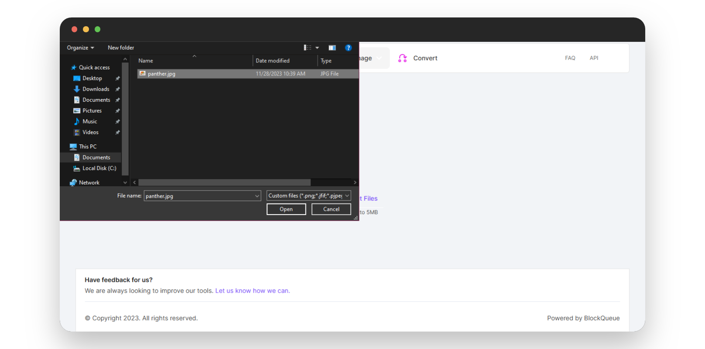
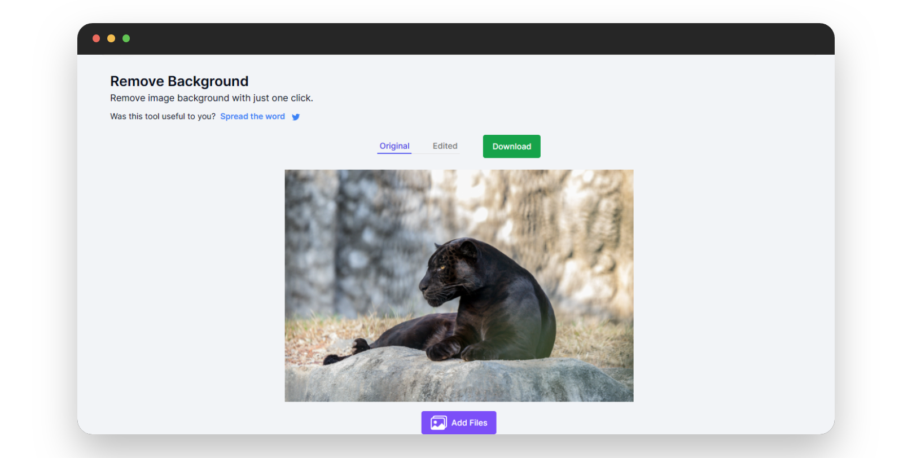
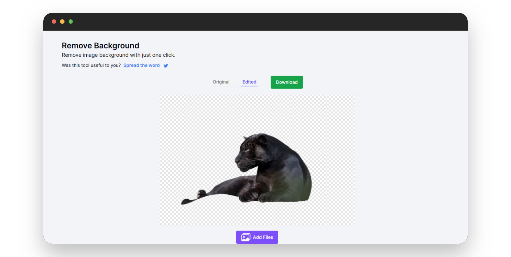
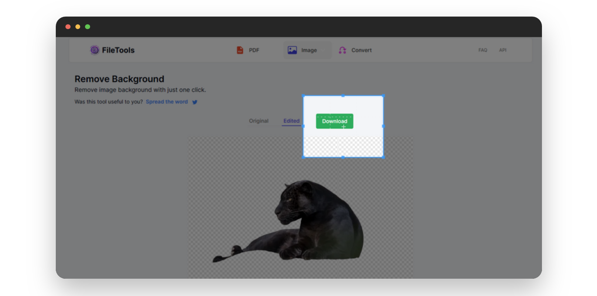

# Precise Background Removal with Our Online Tool

Ever had images that were perfect, but the backgrounds were a mess? A cluttered background detracts from the main subject, leaving your photos less impactful than intended.  
Whether you're a graphic designer, a marketer, or an enthusiast capturing precious moments, the quality of your visuals plays a pivotal role. This is why our image background remover is perfect for whenever you need to remove unwanted backgrounds from your images.

## Reasons You Might Need To Remove Backgrounds From Your Images:

- **Enhance Focus**: By eliminating distractions in the background, your main subject takes center stage, creating a cleaner and more captivating image.
- **Versatility in Design**: Transparent backgrounds provide flexibility, allowing you to seamlessly integrate images into various designs, presentations, or creative projects.
- **Maintain Consistency**: If you're creating a series of images for a project, removing the background can help to maintain a consistent look and feel.
- **Professional Aesthetics**: Whether you're updating your LinkedIn profile picture or showcasing products on an e-commerce site, a polished, background-free image exudes professionalism.

### Benefits Of Using Our Online Image Background Remover

You have access to a free, user-friendly, and instant online tool that effortlessly removes backgrounds from your images, enhancing focus, maintaining consistency, and saving time without any downloads or installations.

***

Below is a step-by-step guide on how to use our image background remover:

- Visit [theFileTools](https://www.thefiletools.com/)

    

- Click on the `Image` button and select `Remove Background` from the dropdown menu

    

- Click on the `Select Files` button on the new page that come sup

    

- Select the image you wish to remove the background of

    

- Here's the original version of the uploaded picture

    

- Here's the edited version   

    

- Download your edited image

    

