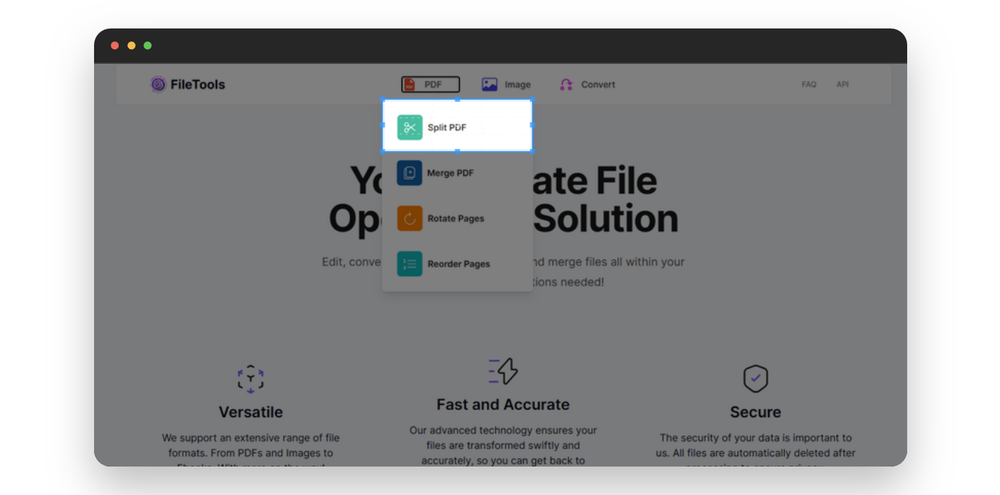
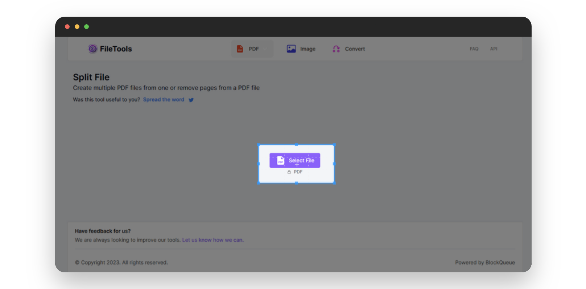
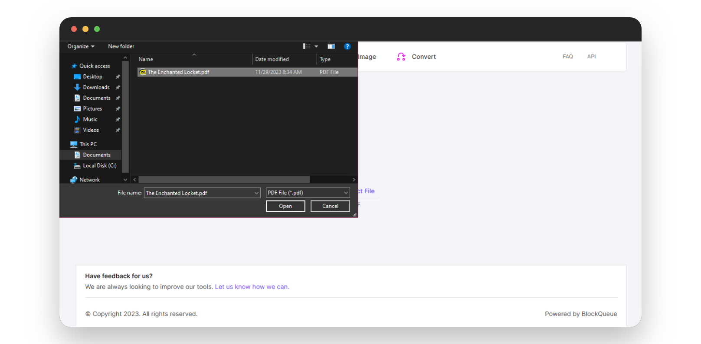
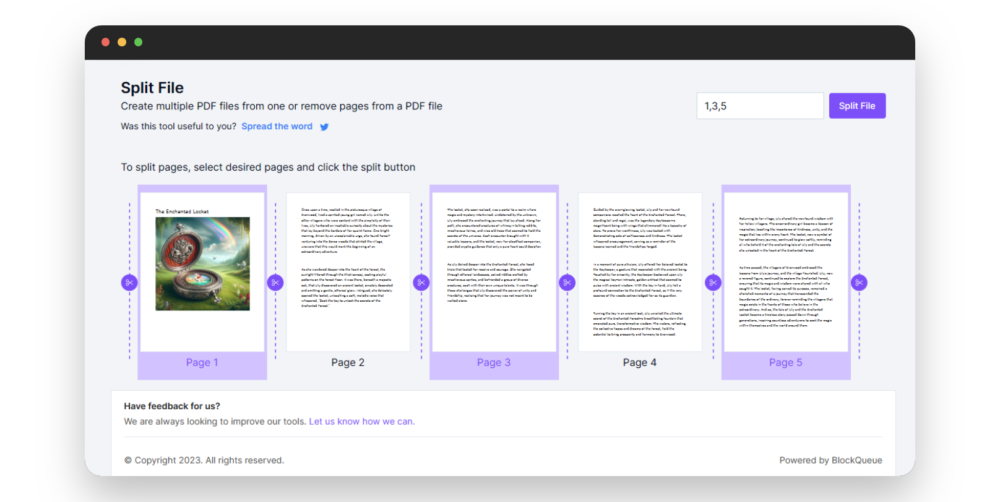
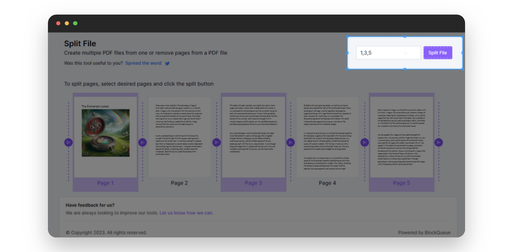
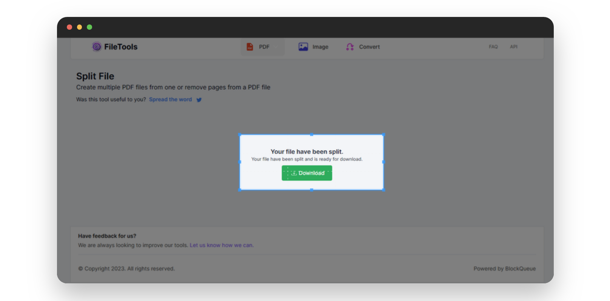

# Simplify Your PDF Experience with Our PDF Splitter

Do you get tired of dealing with long PDFs when you only need a few pages? Our online tool is here to help, with an easy-to-use interface for effortlessly splitting, and extracting pages from PDFs. For individuals wishing to deconstruct their PDFs without difficulty, here's a simple solution without any technical difficulty.

## Reasons To Split PDF Files?
* **Organized Content**: You can quickly extract pages from larger PDFs to create smaller, more focused documents that make it easier to find and share specific information.
* **Efficient Sharing**: To improve communication, divide a document into its relevant pages and share them only, rather than sending the entire document at once.
<!-- * Tailored Documents: Customize your PDFs by combining specific pages from different files, creating a personalized document that suits your needs. -->

### Benefits Of Using Our PDF Splitter:

Our feature-rich PDF splitter is designed to be easy to use, flexible, and straightforward.

***

Below is a step-by-step pictorial guide on how to use our online PDF splitter:

- Visit [theFileTools](https://www.thefiletools.com/)

    

- Click on the `PDF` button and select `Split PDF` from the dropdown menu

    

- Click on the `Select File` button in the new page that comes up

    

- Select the PDF file you wish to split

    

- Mark and select the desired pages

    

- Click the `Split File` button on the top-right corner

    

- Download the split PDF file

    

